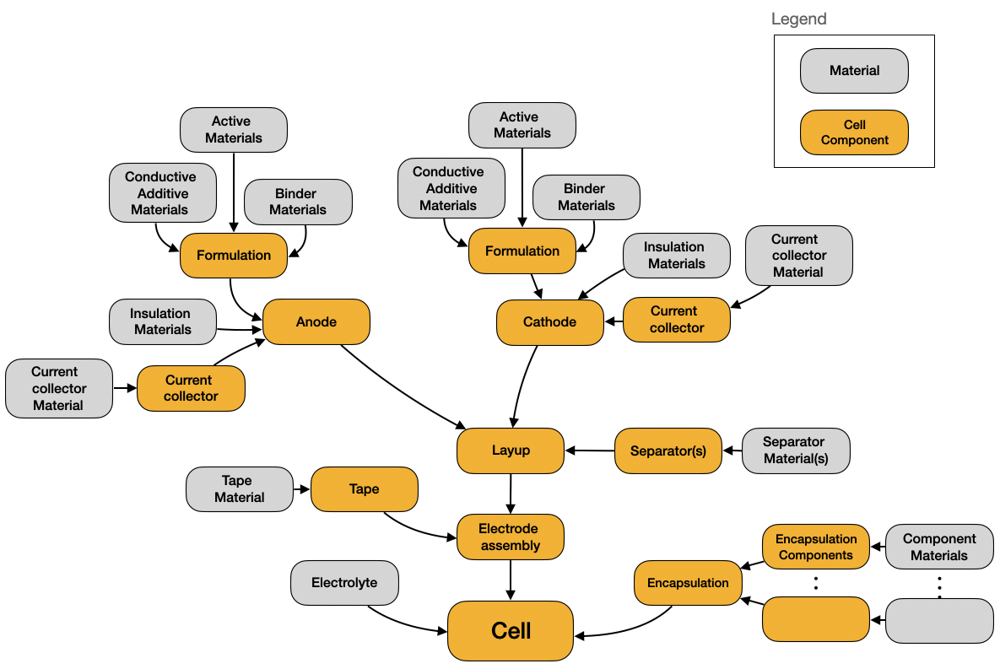

# Summary

OpenCell Design is an open-source Python library that provides a hierarchical, composable API for building virtual battery cells from individual components and materials. The software implements a modeling hierarchy that mirrors the physical construction of a cell — spanning materials, formulations, electrodes, layups, electrode assemblies, encapsulations, and complete cells. Users can construct cylindrical, prismatic, and pouch cell architectures using wound jelly rolls, stacked assemblies, or z-fold stacked assemblies.

OpenCell Design calculates mass and cost at every level of the hierarchy, enabling direct assessment of economic viability alongside electrochemical performance. A propagation system automatically updates all dependent calculations when any parameter changes, eliminating the need to manually rebuild cell models. Interactive browser-based visualizations built on Plotly [@plotly2015] provide immediate feedback through cross-section views, voltage–capacity curves, and hierarchical cost and mass breakdowns.

# Statement of Need

The global transition to electrified transportation and grid-scale energy storage has placed increasing demands on battery technology [@chu2012opportunities; @dunn2011electrical]. Metal-ion batteries are the dominant technology for applications from portable electronics to electric vehicles [@goodenough2013li; @blomgren2017development], and both thermodynamic performance and technoeconomic metrics are critical to their continued development [@nykvist2015rapidly; @ziegler2021re]. Understanding the design and material drivers behind cell performance and cost requires modeling at multiple scales — a single cell comprises dozens of interacting parameters across materials, formulations, current collectors, separators, electrodes, and encapsulations.

Several tools address aspects of this challenge. PyBaMM [@sulzer2021pybamm] provides physics-based electrochemical simulation but does not model the geometric construction of cells or calculate mass and cost breakdowns. BatPaC [@nelson2019batpac] and CAMS [@cams2024] estimate manufacturing cost and performance but are implemented as Excel workbooks, limiting extensibility and programmatic integration. Both are also unidirectional models — outputs depend on a fixed set of inputs, and bidirectional parameter setting is not possible. Other tools such as electrode formulation calculators address isolated aspects of cell design rather than the complete hierarchy from materials to cells.

OpenCell Design fills this gap by providing an open-source, programmatic tool that combines hierarchical cell construction with integrated cost and performance calculations in an extensible, composable framework.

# Software Architecture

The software is distributed as three complementary Python packages, each with its own repository, test suite, and documentation:

- **steer-core** ([github.com/stanford-developers/steer-core](https://github.com/stanford-developers/steer-core)) provides foundational utilities shared across the platform, including validation, serialization with LZ4 compression, bidirectional property propagation, type checking, and interactive Plotly-based plotting mixins.
- **steer-materials** ([github.com/stanford-developers/steer-materials](https://github.com/stanford-developers/steer-materials)) defines the material layer — metals, solvents, and volumed material mixins that track density, cost, mass, and volume with automatic unit conversion and range validation.
- **steer-opencell-design** ([github.com/stanford-developers/steer-opencell-design](https://github.com/stanford-developers/steer-opencell-design)) is the primary package described in this paper. It builds on the previous two to implement the full cell-modeling hierarchy from active materials through to complete cells.

This separation of concerns allows each package to be developed, tested, and versioned independently while ensuring that common behaviors — such as serialization, validation, and change propagation — are defined once in `steer-core` and inherited throughout the stack.

{width=80%}

# Key Features

**Hierarchical modeling architecture.** Components are realized as Python classes organized into a hierarchy that mirrors the physical construction of a cell. Materials are composed into formulations, formulations are coated onto current collectors to form electrodes, electrodes are arranged into layups, layups are wound or stacked into electrode assemblies, and assemblies are encapsulated into complete cells. Properties are calculated at the lowest possible level — specific capacity in the active material, areal capacity in the electrode, total capacity in the cell.

**Bidirectional parameter propagation.** Each object maintains a reference to its parent. When a user modifies a parameter and calls `propagate_changes()`, the system re-assigns the modified object to its parent's setter, triggering recalculation at each level up to the cell. A finer-grained `update()` method propagates changes by a single level, enabling complex studies such as comparing designs at constant volume or constant N/P ratio.

**Extensible object-oriented design.** Base classes implemented as abstract base classes define the interface for each component type. New materials, current collector geometries, and entirely new cell formats can be added by subclassing. To demonstrate this, OpenCell Design includes a flex-frame cell class — a novel solid-state cell architecture — defined in approximately 1,000 lines of code by inheriting the existing base classes and composing existing components.

**Serialization and visualization.** A compact binary serialization format allows cell designs to be saved, shared, and version-controlled. Interactive Plotly-based visualizations provide cross-section views, top-down views, voltage–capacity plots, and sunburst cost/mass breakdowns at any level of the hierarchy.

**Numerical methods.** The library uses NumPy [@harris2020numpy] and SciPy [@virtanen2020scipy] for calculations, including closed-form and adaptive Runge–Kutta integration of thickness-dependent jelly roll spirals accelerated with Numba [@lam2015numba], and Brent's root-finding algorithm [@brent1971algorithm] for constraint satisfaction.

# Quality Control

OpenCell Design includes a comprehensive test suite comprising 21 test modules with over 900 individual test cases, organized to mirror the package structure. Tests cover materials, formulations, electrodes, current collectors, separators, layups, electrode assemblies, containers, and complete cells.

# Acknowledgements

We thank the members of the STEER group at Stanford University for their feedback during the development of this software.

# References
